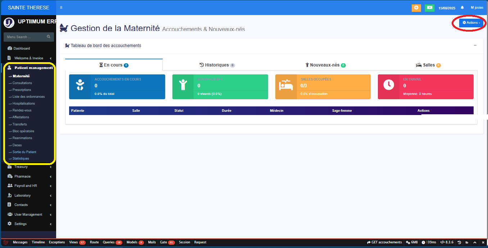
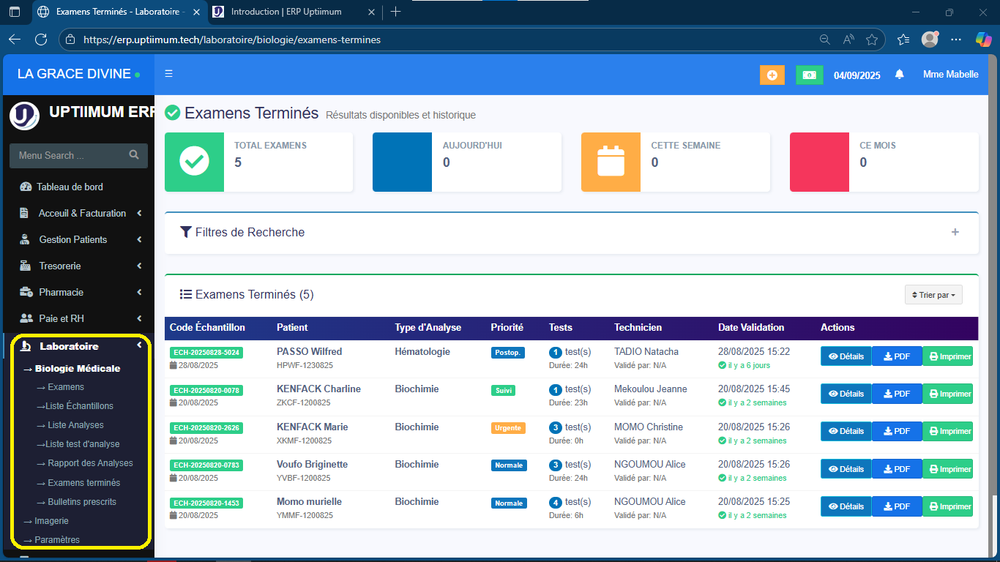
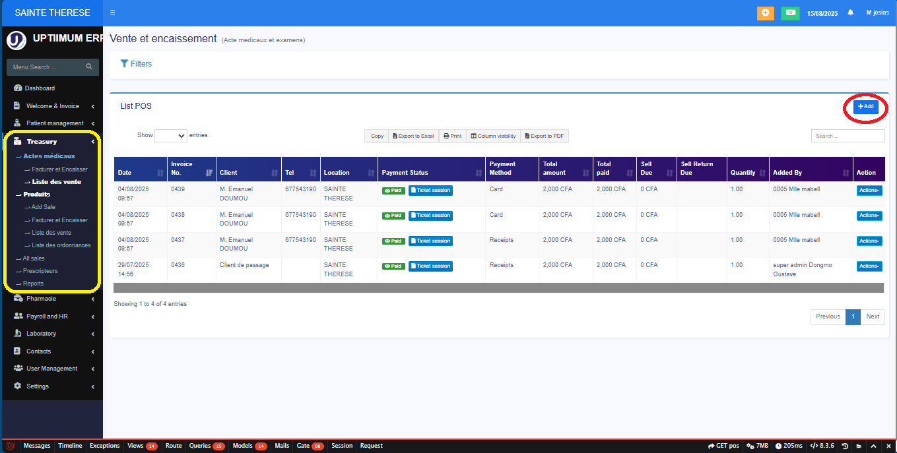
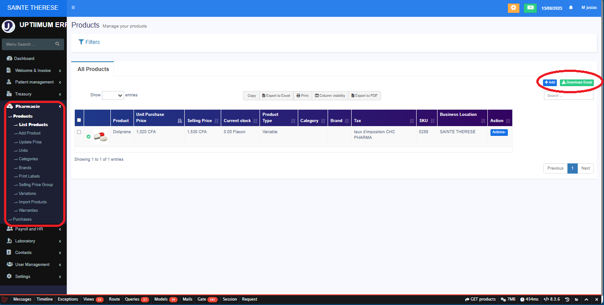
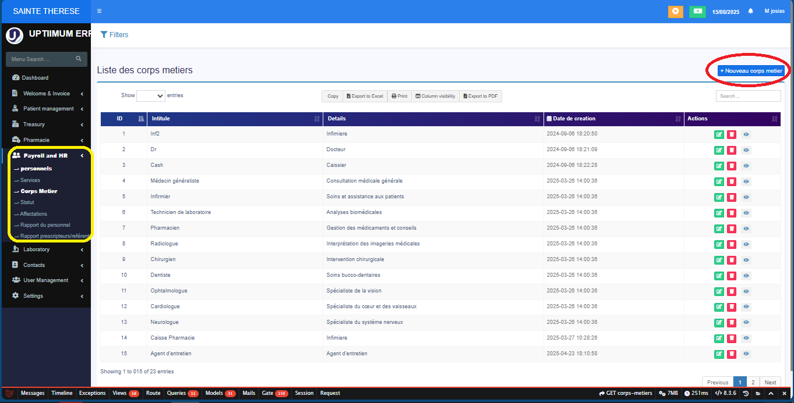

# Introduction

Le progiciel **Uptiimum ERP** offre une solution efficace de gestion intégrée des fonctions de votre entreprise. Avec une interface simple et conviviale, Uptiimum s'adapte facilement aux besoins spécifique et à la taille de votre organisation, qu'elle soit publique ou privée. Il est utilisé par plus de 192 partenaires au Cameroun et en Afrique centrale. Ce qui fait de "Uptiimum ERP le leader incontesté.

---
## Commencer

### Se connecter

Après l'installation de l'ERP Uptiimum dans votre structure par l'administrateur et les équipes DevOps, votre première interaction avec le système sera avec l'interface de connexion à l'ERP telle que présentée par l'image au bas de cette section. Il vous est demandé de renseigné votre adresse email avec laquelle votre compte sur l'application a été créé ainsi que le mot de passe associé. **Vous seul(e) devez le connaître** car il est confidentiel. Une fois terminé, cliquez sur le bouton en-dessous, "**Se Connecter**" et vous vous retrouvez sur l'espace de travail qui vous est destiné.

La case **Se souvenir de moi** permet juste d'enregistrer vos informations de connexion dans votre navigateur, et de ne plus avoir à les saisir à chaque connexion au système.

Si jamais vous avez oublié votre mot de passe, faites un click gauche sur le texte en bleu "Mot de Passe Oublié" et suivez scrupuleusement les indications qui vous sont demandées, étape par étape. Ou alors, contactez votre administrateur système.

## Présentation

Avant d'entrer dans la présentation des modules que propose Uptiimum pour la gestion de votre établissment, l'interface d'accueil est celle-ci :

Vous avez la possibilité de masquer ou d'afficher la barre de menu latérale en appuyant sur les trois traits que pointe la flèche jaune 🎨. 
Dans le cercle Rouge, c'est votre nom d'utilisateur sur la plateforme, celui par lequel vous êtes connu dans le système. Tout près, dans le cadre Orange, c'est la date à laquelle vous vous êtes connecté au système : ces inforamtions sont stockées en temps réel dans les bases de données de l'ERP.
La flêche rouge est un filtre pour les dashboard sur l'écran d'accueil.

### [Gestion Patients](tutorial-basics\Gestion_des_patients.md)

Le module de gestion des patients prend en compte nombreux aspects et renseigne plusieurs catégories diverses. Sur le flanc gauche de votre écran, lorsque vous déroulez la bande du module de gestion des patients, vous avez tous les sous-modules présents dans l'ERP pour suivre les patients. 

D'entrée de jeux, nous avons, telle que présenté sur la photo ci-dessous, le sous-module **maternité**. Il présente un état général sur ce sous-module dans l'établissment sanitaire : nombre de naissances, salles occupées, médécins en charges, etc. On peut suivre les opérations en cours, celles déjà effectuées et même celles qui présentent des complications.

Il en est de même pour les autres sous-modules qui vous sont présentés. Vous voyez un état pour tous les patients concernés et des boutons pour effectuer des actions spécifiques.

    Sous-modules de gestion des patients :    

  {[
    { name: 'Maternité', img: require('../static/img/gestpat-matern.png').default },
    { name: 'Hospitalisation', img: require('../static/img/patients-hospitalisation.png').default },
    { name: 'Consultations', img: require('../static/img/patients-consultations.png').default },
    { name: 'Prescriptions', img: require('../static/img/patients-prescriptions.png').default },
    { name: 'Liste des ordonnances', img: require('../static/img/patients-ordonnances.png').default },
    { name: 'Rendez-vous', img: require('../static/img/patients-rendezvous.png').default },
    { name: 'Affectations', img: require('../static/img/patients-affectations.png').default },
    { name: 'Transferts', img: require('../static/img/patients-transferts.png').default },
    { name: 'Bloc opératoire', img: require('../static/img/patients-bloc.png').default },
    { name: 'Réanimation', img: require('../static/img/patients-reanimation.png').default },
    { name: 'Décès', img: require('../static/img/patients-deces.png').default },
    { name: 'Sorties', img: require('../static/img/patients-sortie.png').default },
    // Ajoute une image pour Statistiques si disponible
    { name: 'Statistiques', img: require('../static/img/patients-statistiques.png').default },
  ].slice(0,12).map((mod, idx) => (
    

      
      
{mod.name}

    

  ))}

Pour rapidement accéder aux tutoriels relatifs aux opérations sur ce module, cliquez sur l'intitulé de ce module sur cette page ou alors, dans la barre de gauche, cliquez sur tutoriel puis sur **Gestion des Patients**.

### [Laboratoire](tutorial-basics\Gestion_laboratoire.md)

Le module Laboratoire de l’ERP Uptiimum est conçu pour optimiser la gestion des examens médicaux au sein des établissements hospitaliers. Il permet de centraliser les demandes d’analyses, de suivre leur traitement en temps réel et d’assurer la transmission rapide et sécurisée des résultats aux médecins prescripteurs. Contrairement à un centre de recherche, ce module se concentre avant tout sur l’efficacité et la fiabilité des examens de routine et spécialisés nécessaires au diagnostic et au suivi des patients. Grâce à son intégration avec les autres modules de l’ERP (gestion patient, facturation, pharmacie), il favorise une meilleure coordination des soins et une traçabilité complète des analyses réalisées.

Pour rapidement accéder aux tutoriels relatifs aux opérations sur ce module, cliquez sur l'intitulé de ce module sur cette page ou alors, dans la barre de gauche, cliquez sur tutoriel puis sur **Laboratoire**.

### [Trésorerie](tutorial-basics\Gestion_tresor.md)

Le module Trésorerie de l’ERP Uptiimum permet de gérer de manière centralisée et efficace l’ensemble des flux financiers d’une organisation, qu’il s’agisse d’un établissement hospitalier ou d’une structure économique comme une boutique ou une superette. Il offre un suivi précis des encaissements et décaissements, la gestion des comptes bancaires, des caisses et des paiements fournisseurs, ainsi que la planification des flux de trésorerie. Grâce à ses outils de reporting et d’alertes, ce module facilite la prise de décision, optimise la gestion des liquidités et assure une visibilité complète sur la santé financière de l’entreprise ou de l’établissemen

Pour rapidement accéder aux tutoriels relatifs aux opérations sur ce module, cliquez sur l'intitulé de ce module sur cette page ou alors, dans la barre de gauche, cliquez sur tutoriel puis sur **Trésorerie**.

### [Pharmacie](tutorial-basics\Gestion_Pharmacie.md)

Le module Pharmacie de l’ERP Uptiimum est spécialement conçu pour gérer efficacement l’ensemble des activités liées à la dispensation et au suivi des médicaments dans un établissement hospitalier. Il permet de gérer les stocks, les commandes fournisseurs, la distribution aux patients et le contrôle des dates de péremption, tout en assurant la traçabilité complète des mouvements de produits pharmaceutiques. Ce module facilite également la prescription sécurisée en lien direct avec le dossier médical des patients, garantissant que les traitements sont correctement administrés et facturés. Grâce à son intégration avec les autres modules de l’ERP, la pharmacie devient un pivot essentiel pour la gestion fluide et sécurisée des soins.

Pour rapidement accéder aux tutoriels relatifs aux opérations sur ce module, cliquez sur l'intitulé de ce module sur cette page ou alors, dans la barre de gauche, cliquez sur tutoriel puis sur **Pharmacie**.

### [Ressources humaines](tutorial-basics\Gestion_ressources_humaines.md)

Le module Ressources Humaines de l’ERP Uptiimum est conçu pour centraliser et simplifier la gestion du personnel au sein des établissements hospitaliers. Il permet de gérer les dossiers des employés, le suivi des contrats, les plannings, les absences, les congés et les affectations, tout en assurant la conformité avec la réglementation en vigueur. Ce module facilite également le suivi des compétences et des formations du personnel, contribuant ainsi à un management efficace et à l’optimisation des ressources humaines. Intégré aux autres modules de l’ERP, il garantit une coordination fluide entre le personnel et les différents services de l’hôpital.

Pour rapidement accéder aux tutoriels relatifs aux opérations sur ce module, cliquez sur l'intitulé de ce module sur cette page ou alors, dans la barre de gauche, cliquez sur tutoriel puis sur **Ressources humaines**.

