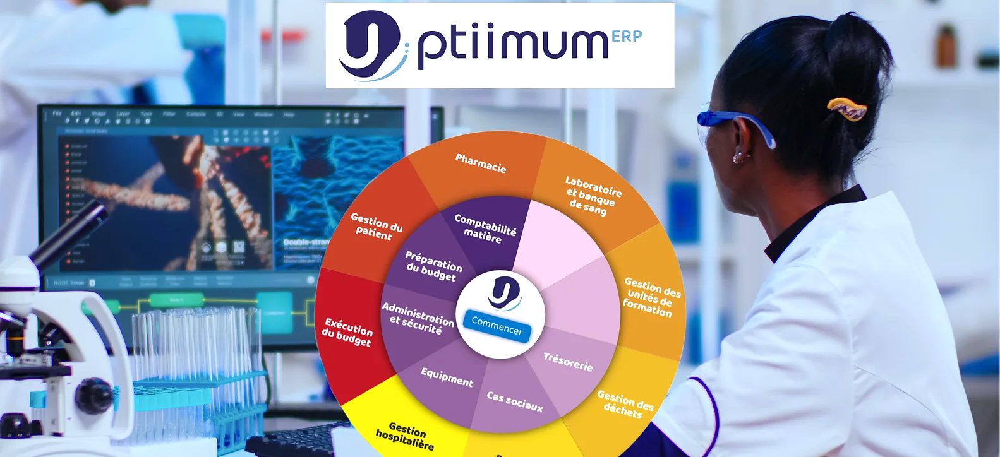

# Introduction

Le progiciel **uptiimum ERP** offre une solution efficace de gestion intégrée des fonctions de votre entreprise. Avec une interface simple et conviviale, "Uptiimum ERP" s'adapte facilement aux besoins spécifique et à la taille de votre organisation, qu'elle soit publique ou privée. "Uptiimum ERP" est utilisé par plus de 192 partenaires au Cameroun et en Afrique centrale. Ce qui fait de "Uptiimum ERP le leader incontesté

## Commencer

### Se connecter

Trouvez ci-dessous la procédure pour entrer dans votre session utilisateur

## Présentation

### les différents modules